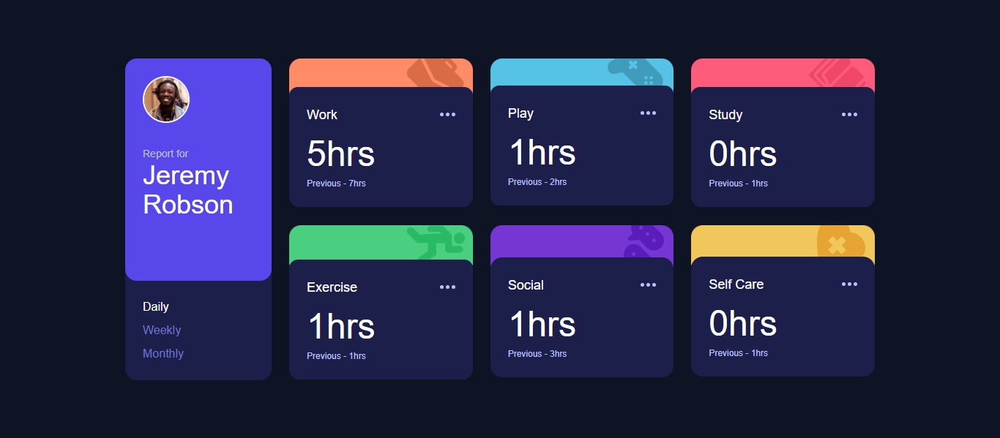

# Frontend Mentor - Time Tracking Dashboard

This is a solution to the [Time Tracking Dashboard challenge on Frontend Mentor](https://www.frontendmentor.io/challenges/time-tracking-dashboard-UIQ7167Jw). The project is a responsive dashboard displaying time spent on activities (Work, Play, Study, etc.) with toggleable Daily, Weekly, and Monthly views, defaulting to Monthly.

## Table of Contents

- [Overview](#overview)
  - [The Challenge](#the-challenge)
  - [Screenshot](#screenshot)
  - [Links](#links)
- [My Process](#my-process)
  - [Built With](#built-with)
  - [What I Learned](#what-i-learned)
  - [Continued Development](#continued-development)
  - [Useful Resources](#useful-resources)
- [Author](#author)

## Overview

### The Challenge

Users should be able to:

- View the optimal layout for their device's screen size.
- See hover states for interactive elements.
- Switch between Daily, Weekly, and Monthly stats, with Monthly shown initially.

### Screenshot

### Links

- Solution URL: [GitHub Repository](https://github.com/amikoelvis/Time-Tracking-Dashboard)
- Live Site URL: [Live Demo](https://time-tracking-dashboard-inky-chi.vercel.app/)

## My Process

### Built With

- Semantic HTML5 markup
- Tailwind CSS
- Flexbox and CSS Grid
- Mobile-first workflow
- JavaScript

### What I Learned

I learned to implement a responsive layout with Tailwind CSS, using `flex md:flex-col` for mobile-to-desktop transitions and JavaScript’s `showTimeframe('monthly')` for the HTML version. Left-aligning buttons with `text-left w-full` improved readability:

### Continued development

I plan to add accessibility with aria-pressed for buttons and dynamic data via JSON fetching to replace hardcoded values. Enhancing UX with CSS transitions for timeframe switching is also a goal.

### Useful resources

- [Tailwind CSS Documentation](https://tailwindcss.com/docs) - This helped me with the styling.
- [Using data attribute](https://developer.mozilla.org/en-US/docs/Web/HTML/How_to/Use_data_attributes) - This is an amazing article which helped me understand using data attribute. I'd recommend it to anyone still learning this concept.

## Author

- Website - [Amiko Elvis](https://time-tracking-dashboard-inky-chi.vercel.app/)
- Frontend Mentor - [@amikoelvis](https://www.frontendmentor.io/profile/amikoelvis)
- Twitter - [@ElvisAmiko](https://www.twitter.com/ElvisAmiko)

## Acknowledgments

Thank you to Frontend Mentor!
